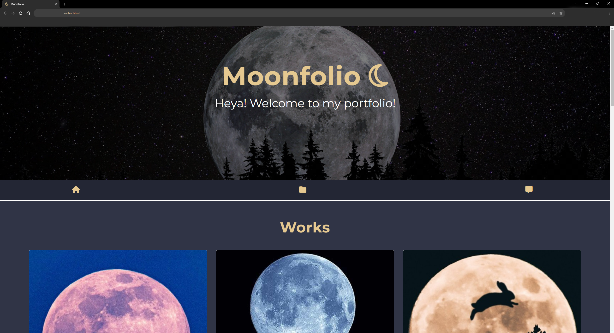

# Bootstrap Moonfolio
This is a recreated bootstrap portfolio of my previous portfolio made from scratch. This website is created in mind of the previous portfolio I developed with HTML and styled with CSS with Bootstrap as its framework. 

## Here is my live application! 
https://lunar-potato.github.io/bootstrap-portfolio/

Here is the previous moonfolio made from scratch -> https://lunar-potato.github.io/moonfolio/

## Description
This bootstrap moonfolio shows how one can recreate a website made from scratch with the use of Bootstrap and customizing that bootstrap to make it unique. This website is made in theme of the previous website which has a dark themed to make it easy on the eyes.

## Instalation
N/A

## Usage
This website can be used to show how bootstrap can be customized and be used for portfolios. This can also be used for inspirations on what to add to their own portfolios. 

## Credits
This website is created with Bootstrap.

## License 
License is under MIT. Please refer to the LICENSE in the repository.